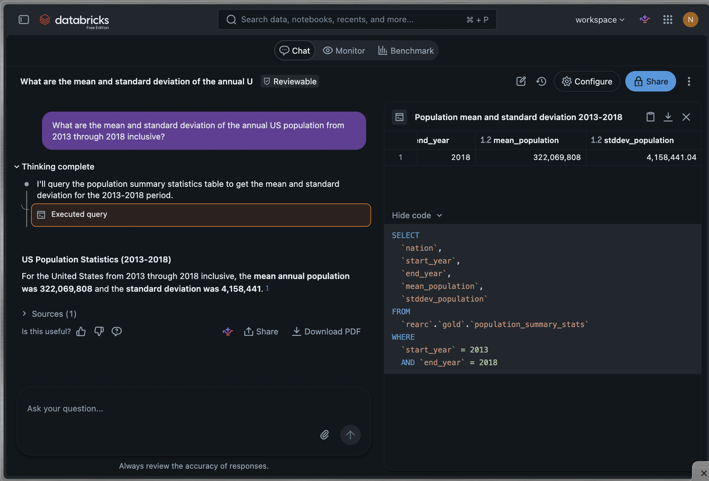
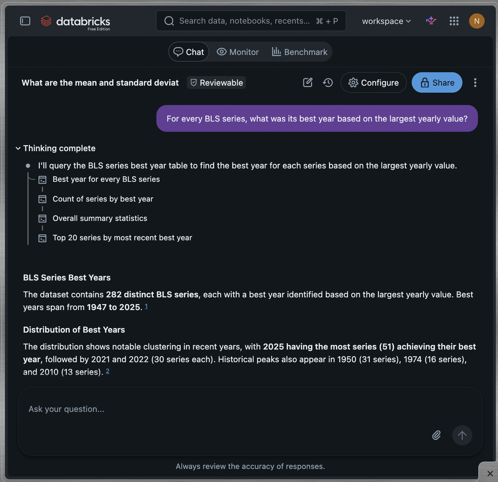
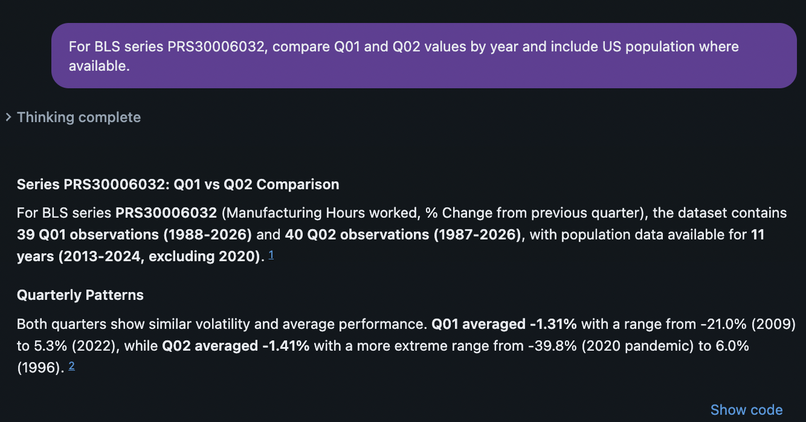
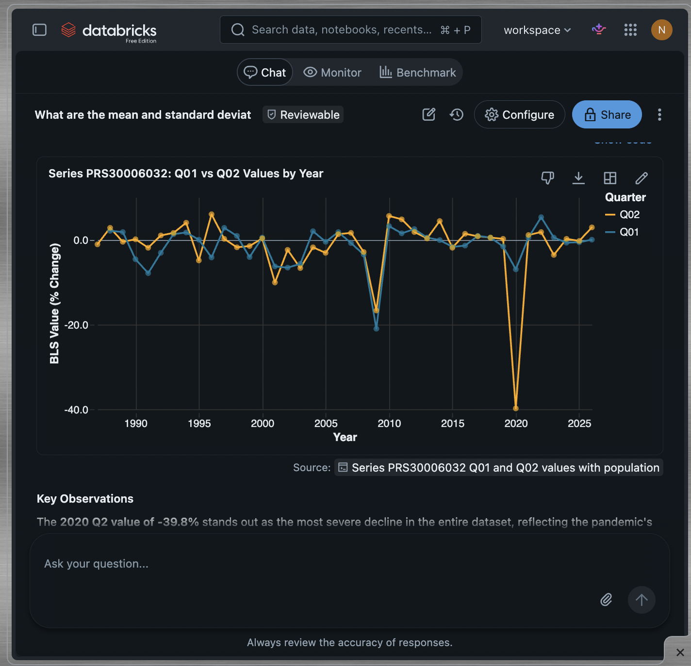

# Bureau of Labor Statistics and US Population Analysis

Databricks Spark Declarative Pipelines following a medallion architecture to ingest, model, validate, and analyze US population data alongside Bureau of Labor Statistics productivity time-series data.

This project was built in **Databricks Free Edition** using **serverless compute**, **Unity Catalog**, **PySpark / Spark SQL**, and **Spark Declarative Pipelines**.

## Project Overview

The project combines two public datasets:

- **US population data** from the Data USA API, sourced from the US Census Bureau's ACS 1-year estimates.
- **Bureau of Labor Statistics productivity data** from the BLS public productivity time-series files.

Source data is landed in Unity Catalog Volumes and processed through **Bronze, Silver, and Gold** layers. The Gold layer contains both reusable analytical models and assignment-specific outputs.

Detailed architecture decisions, trade-offs, ingestion behavior, business rules, and retrospective notes are documented separately in [`PROCESS.md`](PROCESS.md).

The final answers to the three analytical questions are available in [`results/three_questions_output.md`](results/three_questions_output.md).

## Analytical Questions

The project answers the following questions:

1. **What are the mean and standard deviation of the annual US population across 2013-2018 inclusive?**

2. **For every `series_id` in the BLS data, what's the best year, meaning the year with the largest sum of `value` across all its quarters?**  
   For example, if `PRS30006011` has values 1, 2 in 1995 and 3, 4 in 1996, its best year is 1996 with a summed value of 7. Include enough of a human-readable label for each series that someone unfamiliar with BLS series codes could understand at a glance what's actually being measured.

3. **For `series_id = PRS30006032` and `period = Q01`, what was the `value` each year, joined with that year's `population` where available?**

See [`results/three_questions_output.md`](results/three_questions_output.md) for the resulting outputs.

## Data Sources

### US Population

Population data is retrieved from the Data USA API using ACS 1-year population estimates.

The ingestion process stores each API response as an immutable, timestamped JSON file in a Unity Catalog Volume before the data is processed by the pipeline.

### Bureau of Labor Statistics

Productivity time-series data is retrieved from the BLS public `pr` dataset:

<https://download.bls.gov/pub/time.series/pr/>

The ingestion code dynamically discovers the supported source files in the BLS productivity directory and lands them in the Unity Catalog Volume for downstream processing.

The BLS contact email is stored as a **Unity Catalog secret** (`catalog="rearc"`, `schema="secrets"`, `key="bls_contact_email"`), accessed by the `00_UC_Schemas_and_Volumes_Setup` notebook.

## Technology

- Databricks Free Edition
- Databricks serverless compute
- Unity Catalog
- Unity Catalog Volumes
- Spark Declarative Pipelines
- PySpark
- Spark SQL
- Python
- PyTest
- Databricks Genie

## Architecture at a Glance

The project follows a medallion architecture:

**Source APIs / files → Unity Catalog Volume → Bronze → Silver → Gold**

At a high level:

- **Landing** preserves source data in the Unity Catalog Volume.
- **Bronze** represents the source datasets with minimal transformation.
- **Silver** applies typing, naming, validation, and reusable data-quality rules.
- **Gold** produces business-ready analytical models and the tables needed to answer the three questions.

For the reasoning behind the layer boundaries, SQL vs. PySpark choices, safe re-running of ingestion, schema handling, and business-rule decisions, see [`PROCESS.md`](PROCESS.md).

## Repository Structure

```text
.
├── docs/
│   └── images/
│
├── population_and_productivity_pipeline/
│   ├── explorations/
│   ├── transformations/
│   └── utilities/
│
├── results/
│   └── three_questions_output.md
│
├── security/
│   ├── gold_read_only_access.sql
│   └── verify_gold_access.sql
│
├── 00_UC_Schemas_and_Volumes_Setup
├── 01_incremental_ingest_bls_to_volume
├── 01_incremental_ingest_population_to_volume
├── export_assignment_results
├── PROCESS.md
└── README.md
```

### Key directories

- `population_and_productivity_pipeline/transformations/` contains the Spark Declarative Pipeline transformations that materialize the Bronze, Silver, and Gold layers.
- `population_and_productivity_pipeline/utilities/` contains shared pipeline configuration and helper logic.
- `population_and_productivity_pipeline/tests/` contains PyTest-based tests for selected transformation logic.
- `population_and_productivity_pipeline/explorations/` contains development and validation work that is useful for understanding or checking the data but is not part of the production pipeline.
- `results/` contains exported assignment outputs.
- `docs/images/` contains screenshots used in the project documentation.
- `security/` contains example SQL for granting and verifying read-only access to the Gold layer.

## Running the Project

### 1. Import the repository into Databricks

Clone or import the repository into a Databricks workspace:

<https://github.com/nathanwessel/bureau-of-labor-statistics-population-analysis>

### 2. Create the Unity Catalog objects

Run:

```text
00_UC_Schemas_and_Volumes_Setup
```

This creates the Unity Catalog schemas and Volume locations used by the project.

### 3. Configure the BLS contact email

The BLS contact email is stored as a **Unity Catalog secret** (`catalog="rearc"`, `schema="secrets"`, `key="bls_contact_email"`), accessed by the `00_UC_Schemas_and_Volumes_Setup` notebook. The BLS ingestion notebook retrieves it via `dbutils.secrets.get(catalog="rearc", schema="secrets", key="bls_contact_email")`.

### 4. Land the source data

Run the two ingestion notebooks:

```text
01_incremental_ingest_population_to_volume
01_incremental_ingest_bls_to_volume
```

These notebooks retrieve the source datasets and land them in the Unity Catalog Volume used by the pipeline.

### 5. Create the Spark Declarative Pipeline

In the Databricks UI, create a Spark Declarative Pipeline using serverless compute and configure:

```text
population_and_productivity_pipeline/
```

as the pipeline source directory.

The pipeline source code in this directory defines the Bronze, Silver, and Gold datasets.

### 6. Run the pipeline

Run the Spark Declarative Pipeline to materialize the Bronze, Silver, and Gold tables.

### 7. Review the analytical results

The results can be reviewed in two ways:

- Open [`results/three_questions_output.md`](results/three_questions_output.md) for the exported answers to all three questions.
- Query the Gold tables directly in Databricks.

## Gold Data Products

The main analytical interface to the project is the Gold layer.

### `rearc.gold.population_by_year`

Reusable annual US population model.

### `rearc.gold.population_summary_stats`

Curated population summary statistics used to answer Question 1.

### `rearc.gold.bls_series_best_year`

Best-year result for each BLS series, including human-readable series information, used to answer Question 2.

### `rearc.gold.bls_series_period_population_by_year`

Reusable model joining BLS series-period observations to annual US population where population data is available.

### `rearc.gold.bls_prs30006032_q01_population_by_year`

Assignment-specific Gold model for Question 3.

Detailed business rules used to build these models, including period handling and best-year logic, are documented in [`PROCESS.md`](PROCESS.md).

## Data Quality and Testing

Data quality is primarily enforced directly in the Spark Declarative Pipeline through expectations at transformation boundaries.

Examples include validation of:

- required keys
- expected schemas
- valid BLS period values
- uniqueness assumptions
- malformed or unexpected source records

The repository also includes **PyTest-based tests for selected transformation logic** under `population_and_productivity_pipeline/tests/`.

The Spark Declarative Pipeline expectations are the primary pipeline-level data-quality controls. The PyTest suite is included as additional development-time validation and should not be interpreted as the sole validation mechanism for the project.

## Assignment Deliverables

The requested submission materials are available in this repository:

- **Source code:** this repository
- **Thought process and design decisions:** [`PROCESS.md`](PROCESS.md)
- **Answers to the three analytical questions:** [`results/three_questions_output.md`](results/three_questions_output.md)
- **Screenshots:** [`docs/images/`](docs/images/)

## Bonus: Databricks Genie Agent

To make the Gold layer easier for a non-technical stakeholder to explore, I created a Databricks Genie Agent named **Bureau of Labor Statistics and US Population Analytics**.

The agent is backed only by curated Gold tables and includes verified example queries for the three analytical questions. It can also answer broader exploratory questions using the reusable Gold models.

The Genie Agent is configured to prefer the most specific Gold model for each use case:

- `rearc.gold.population_summary_stats` for population summary statistics
- `rearc.gold.bls_series_best_year` for best-year analysis
- `rearc.gold.bls_prs30006032_q01_population_by_year` for the assignment-specific BLS/population question
- `rearc.gold.population_by_year` for broader population analysis
- `rearc.gold.bls_series_period_population_by_year` for broader BLS period and population exploration

### Population summary

A stakeholder can ask the first analytical question directly in natural language. Genie uses the curated population summary Gold table rather than recalculating the metric from lower-level data.



### Best year by BLS series

Genie uses the curated `bls_series_best_year` model for best-year analysis.



### Broader self-service exploration

The Agent is not limited to the three assignment questions. For example, a stakeholder can compare Q01 and Q02 values for a BLS series and include annual US population where available. Genie can use the reusable `bls_series_period_population_by_year` Gold model for this broader analysis.





## Additional Documentation

For implementation details beyond this repository overview:

- [`PROCESS.md`](PROCESS.md) documents architecture decisions, trade-offs, business rules, re-run behavior, and retrospective notes.
- [`results/three_questions_output.md`](results/three_questions_output.md) contains the final outputs for the three analytical questions.
